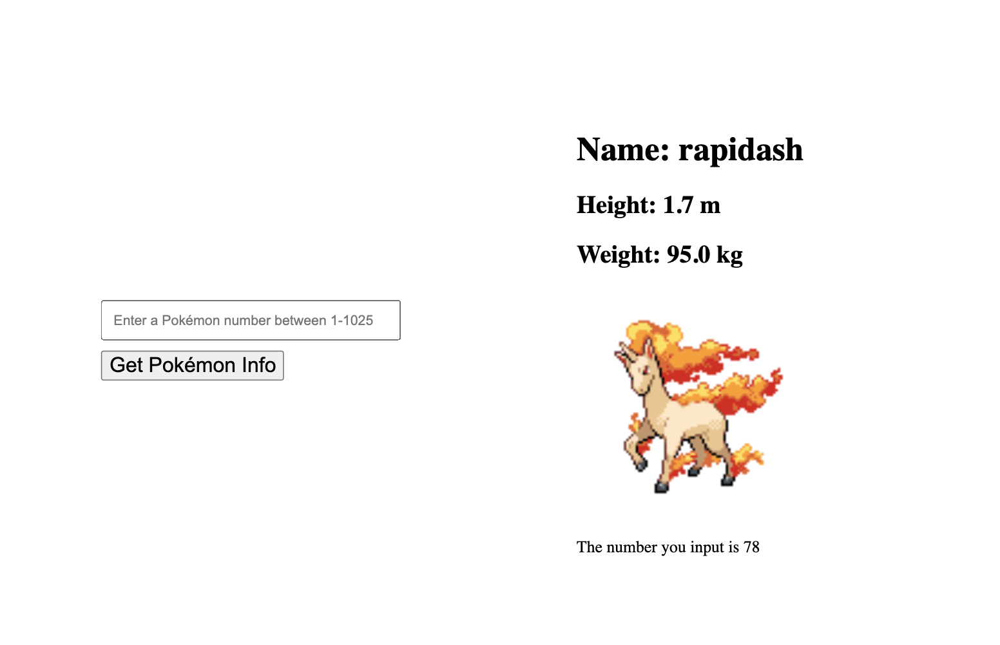

<h1 align="center">Hi 👋, I'm Peifang Luo</h1>
<h2 align="left">A passionate software engineer from China, living in Budapest</h2>
 
- 🌱 I’m currently in CFG degree and learning FE development myself.

- 👨‍💻 All of my projects are available at [https://github.com/117Isabell](https://github.com/117Isabell)

- 📫 How to reach me **lpfisabell@gmail.com**

<h2 align="left"> What is this repo for:</h2>
<p align="left">All the assigments for CFGdegree 2024 autumn </p>

<br><br>

<h1 align="left">Week Two & Week Three:</h1>

# Pokémon API Project Preview

This is a Flask application that interacts with the Pokémon API to fetch and display Pokémon data. The application allows users to input a Pokémon number between 1-1025 and see details, including a name, height, weight and an image of the Pokémon.The user can save the json data in a json file and key infos in a text file locally too. The landing page updates dynamically based on user input.

# Screenshot



# A video demon of the project
Check out the demo video: [Watch on YouTube](https://youtu.be/3kUayEoKSg4)


# Run on Your Local Machine

1. Clone that repo locally:
   ```bash
   git clone https://github.com/117Isabell/CFG-Assignments.git
   ```
2. Open the project in PyCharm
3. Install Dependencies
4. Navigate to the root Directory
5. Run the project locally:
   ```bash
   python3 pokemon.py
   ```
6. Open in a Browser:
   <p>Once the server is running, open your web browser and navigate to the local link provided in the terminal (usually http://127.0.0.1:5000).
</p>

<h4>Inspirations</h4>
1. My old Pokemon API project in JS: https://github.com/117Isabell/pokedex_projects
2. This Python flask tutorial: https://www.youtube.com/watch?v=dam0GPOAvVI

<br><br>

<h1 align="left">Week One:</h1>

<p align="left">Session 3--Clone a repo and connect remote and local repo:</p>

If making a repository locally - start from:

1. If cloning a repository, `git clone repository`, ensure you have the main (default branch) changes pulled, and then continue from step 3.
2. If you have a repository already connected/setup on GitHub, replace step 1 with checking out main (`git checkout origin main`) and pulling the changes (`git pull`).

Steps:

1. `git init`
2. `git checkout -b new_branch_name` <- to work on a branch (we did not cover this today though)
3. Make your changes, add files, edit code, etc.
4. When you wish to save, add your files to the staging area (bank of things to be committed) using `git add .` (or `git add filename`)
5. `git commit -m "meaningful commit message"`
6. `git push`
7. If you don't have a branch set up on the remote yet (we didn't cover branches today), it will tell you what code to run (e.g., `git push --set-upstream origin branch_name`)
8. Repeat from step 3 until you're complete (you'll look at when to move onto a new branch, and what they are in more detail, later)

<p align="left">Session 4--Create and switch branches, push local changes and create pull requests:</p>

1. Make a repo on GitHub (including the readme file option and make sure it's private).
2. Clone that repo locally:
   ```bash
   git clone https://github.com/username/repo.git
   ```
3. Make a branch:
   ```bash
   git switch name-of-branch
   ```
4. Make the changes locally:
   ```bash
   git add .
   git commit -m "description of the changes you made!"
   git push
   ```

<br><br>


<h5 align="left">My Languages and Tools:</h5>
<p align="left"> <a href="https://getbootstrap.com" target="_blank" rel="noreferrer">  </a> <a href="https://www.w3schools.com/css/" target="_blank" rel="noreferrer">  </a> <a href="https://www.docker.com/" target="_blank" rel="noreferrer">  </a> <a href="https://expressjs.com" target="_blank" rel="noreferrer">  </a> <a href="https://git-scm.com/" target="_blank" rel="noreferrer">  </a> <a href="https://www.w3.org/html/" target="_blank" rel="noreferrer">  </a> <a href="https://developer.mozilla.org/en-US/docs/Web/JavaScript" target="_blank" rel="noreferrer">  </a> <a href="https://www.linux.org/" target="_blank" rel="noreferrer">  </a> <a href="https://www.mongodb.com/" target="_blank" rel="noreferrer">  </a> <a href="https://www.mysql.com/" target="_blank" rel="noreferrer">  </a> <a href="https://nodejs.org" target="_blank" rel="noreferrer">  </a> <a href="https://postman.com" target="_blank" rel="noreferrer">  </a> <a href="https://reactjs.org/" target="_blank" rel="noreferrer">  </a> <a href="https://sass-lang.com" target="_blank" rel="noreferrer">  </a> </p>
<p></p>
<h5 align="left">Let's connect:</h5>
<p align="left">
<a href="https://www.linkedin.com/in/peifang-luo-dev/" target="_blank"></a>
</p>